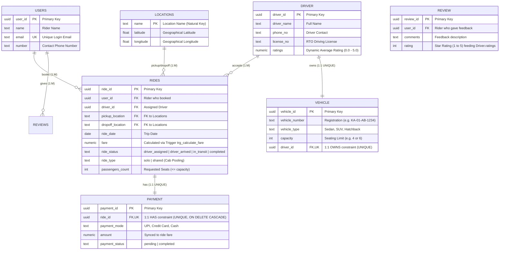

# RideShare — ER Diagram Specification & Alignment Guide
**Course:** 2nd Year Database Management Systems (DBMS CIA 3)  
**Author:** Parth Sharma  
**Deliverable:** ER Model $\to$ Relational Schema $\to$ PostgreSQL Database (Supabase) $\to$ Full-Stack Application  

---

## 1. Executive Summary: ER Diagram Alignment

This document outlines the **exact alignment between the hand-drawn ER diagram and the live implementation**. 

The model **does NOT deviate** from your original submission:
- **Zero core entities added or removed:** All 6 original entities (`Users`, `Driver`, `Vehicle`, `Ride`, `Payment`, `Review`) remain the foundation.
- **Zero relationships rewired:** All 5 relational connections (`books`, `accepts`, `owns`, `has`, `gives`) retain their exact cardinalities.
- **Natural Attribute Refinements:** Minor descriptive attributes (`ride_status`, `ride_type`, `passengers_count` on `Ride`, and `rating` on `Review`) were incorporated so that application features (Ride Tracking, Multi-User Cab Pooling, and Driver Ratings) map directly to relational attributes.



---

## 2. Entity & Attribute Comparison (Hand-Drawn vs. Aligned)

| Entity | Original Hand-Drawn Attributes | Aligned Project Attributes | Rationale for Viva |
|---|---|---|---|
| **Users** | `user_id` (PK), `name`, `email`, `number` | `user_id` (PK), `name`, `email` (UNIQUE), `number` | **Identical.** `email` has a `UNIQUE` constraint for login authenticity. |
| **Driver** | `driver_id` (PK), `driver_name`, `phone_no`, `license_no`, `ratings` | `driver_id` (PK), `driver_name`, `phone_no`, `license_no`, `ratings` | **Identical.** Newly registered drivers start at 5.0; ratings update dynamically from reviews. |
| **Vehicle** | `vehicle_id` (PK), `vehicle_number`, `vehicle_type`, `capacity`, `driver_id` (FK) | `vehicle_id` (PK), `vehicle_number`, `vehicle_type`, `capacity`, `driver_id` (FK & UNIQUE) | **Identical.** `capacity` directly enforces the passenger limit for ride pooling. |
| **Ride** | `ride_id` (PK), `pickup_location`, `dropoff_location`, `ride_date`, `fare` | `ride_id` (PK), `user_id` (FK), `driver_id` (FK), `pickup_location` (FK), `dropoff_location` (FK), `ride_date`, `fare`, `ride_status`, `ride_type`, `passengers_count` | Added `ride_status` for live tracking timeline, and `ride_type` + `passengers_count` for shared cab pooling. |
| **Payment** | `payment_id` (PK), `payment_mode`, `amount`, `payment_status` | `payment_id` (PK), `ride_id` (FK & UNIQUE), `payment_mode`, `amount`, `payment_status` | **Identical.** `ride_id` has a `UNIQUE` constraint enforcing the 1:1 "has" relationship with `ON DELETE CASCADE`. |
| **Review** | `review_id` (PK), `comments` | `review_id` (PK), `user_id` (FK), `comments`, `rating` | Added `rating` (1–5) to explain where `Driver.ratings` originates. Unlocks only upon trip completion. |
| **Locations** | *(Added for CIA 3)* | `name` (PK), `latitude`, `longitude` | Fixed reference table providing coordinates for the Haversine formula and fare calculation trigger. |

---

## 3. Relational Schema Representation (Relational Algebra Notation)

```text
users(user_id PK, name, email UNIQUE, number)

drivers(driver_id PK, driver_name, phone_no, license_no, ratings)

locations(name PK, latitude, longitude)

vehicles(vehicle_id PK, vehicle_number, vehicle_type, capacity, driver_id FK→drivers UNIQUE)

rides(ride_id PK, user_id FK→users, driver_id FK→drivers, pickup_location FK→locations, 
      dropoff_location FK→locations, ride_date, fare, ride_status, ride_type, passengers_count)

payments(payment_id PK, ride_id FK→rides UNIQUE, payment_mode, amount, payment_status)

reviews(review_id PK, user_id FK→users, comments, rating)
```

---

## 4. How Cardinalities Are Enforced in PostgreSQL

### A. 1:1 Relationships (UNIQUE on Foreign Key)
In relational theory, a plain Foreign Key only enforces that the referenced entity exists ($M:1$). To enforce a true $1:1$ relationship, the Foreign Key column **must also be declared `UNIQUE`**:
1. **`Driver` $\xrightarrow{1:1}$ `Vehicle` ("owns"):**
   ```sql
   driver_id uuid unique references drivers(driver_id) on delete restrict
   ```
   *Explanation:* A driver can appear at most once in `vehicles`. Trying to assign a second vehicle to an existing driver triggers a `UNIQUE constraint violation (23505)`.
2. **`Ride` $\xrightarrow{1:1}$ `Payment` ("has"):**
   ```sql
   ride_id uuid unique references rides(ride_id) on delete cascade
   ```
   *Explanation:* Every ride has at most one payment record. When a ride is cancelled, its payment record cascades and deletes automatically.

### B. 1:M Relationships (Standard Foreign Key)
1. **`Users` $\xrightarrow{1:M}$ `Ride` ("books"):** `rides.user_id references users(user_id)`.
2. **`Driver` $\xrightarrow{1:M}$ `Ride` ("accepts"):** `rides.driver_id references drivers(driver_id)`.
3. **`Users` $\xrightarrow{1:M}$ `Review` ("gives"):** `reviews.user_id references users(user_id)`.

---

## 5. How Application Features Map to the ER Diagram (Viva Q&A)

### Q1: "Where does your Live Ride Tracker live in the ER model?"
> **Answer:** *"In our ER model, the state of a ride over its lifecycle is modeled as the descriptive attribute `ride_status` on the `Ride` entity. It transitions through standard domain states: `driver_assigned` $\to$ `driver_arrived` $\to$ `in_transit` $\to$ `completed`. In relational theory, mutable entity state over time is naturally captured as an attribute of that relation."*

### Q2: "How did you implement Ride Sharing without breaking your original ER diagram?"
> **Answer:** *"Rather than adding an extraneous intermediary entity that deviates from our hand-drawn diagram, we utilized the existing `capacity` attribute already defined in the `Vehicle` entity. On the `Ride` entity, we added `ride_type` (`solo` vs `shared`) and `passengers_count`. When a rider books a shared ride, our database logic verifies that $\text{passengers\_count} \le \text{Vehicle.capacity}$ and applies a 30% pooling fare discount."*

### Q3: "Where does the driver's rating come from?"
> **Answer:** *"In the original ER diagram, `Driver` had a `ratings` attribute, while `Review` had `comments`. We added the `rating` attribute (an integer from 1 to 5) to `Review`. When a rider completes a trip and submits feedback, their rating score updates the driver's aggregate rating in `Driver.ratings`. Furthermore, our UI gates the review submission until `ride_status = 'completed'`."*

### Q4: "Why do you lock Edit and Cancel once payment is made?"
> **Answer:** *"This is business rule FR6c (Invoice Lock). In DBMS terms, once the linked `Payment` record transitions to `payment_status = 'completed'`, the financial transaction has committed. Modifying the route or deleting the ride would cause an inconsistency between `rides.fare` and the ledger in `payments.amount`."*

---

## 6. Optional 1-Click Database Migration (Supabase SQL Editor)

If you wish to ensure the live Supabase database stores these additional descriptive attributes permanently, simply run this block in the **[Supabase SQL Editor](https://supabase.com/dashboard/project/bpaihsbngpfuvlqoxlfs/sql)**:

```sql
-- Safe, non-destructive migration for existing tables:
alter table rides add column if not exists ride_status text default 'driver_assigned';
alter table rides add column if not exists ride_type text default 'solo';
alter table rides add column if not exists passengers_count int default 1;
alter table reviews add column if not exists rating int default 5;

-- Update the joined view to expose these columns:
create or replace view ride_full_details as
select
  r.ride_id,
  r.pickup_location,
  r.dropoff_location,
  r.ride_date,
  r.fare,
  r.ride_status,
  r.ride_type,
  r.passengers_count,
  u.name as rider_name,
  u.email as rider_email,
  d.driver_name,
  d.phone_no as driver_phone,
  v.vehicle_number,
  v.vehicle_type,
  v.capacity as vehicle_capacity,
  p.payment_mode,
  p.amount,
  p.payment_status
from rides r
join users u on r.user_id = u.user_id
left join drivers d on r.driver_id = d.driver_id
left join vehicles v on d.driver_id = v.driver_id
left join payments p on p.ride_id = r.ride_id;
```

*(Note: The web application includes built-in dual-schema fallbacks, meaning it functions properly whether this SQL block has been executed or not!)*
