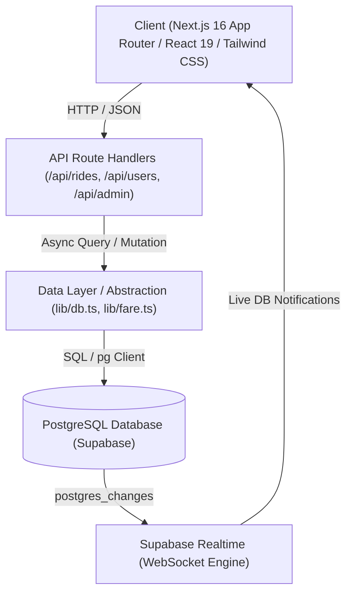
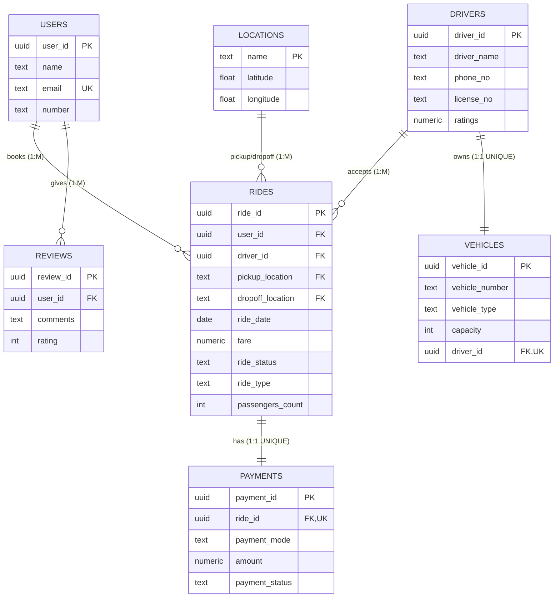

# RideShare — Relational Database Management System & Full-Stack Platform

[](https://nextjs.org/)
[](https://react.dev/)
[](https://www.typescriptlang.org/)
[](https://www.postgresql.org/)
[](https://supabase.com/)
[](https://tailwindcss.com/)

An enterprise-grade, evaluation-ready relational ridesharing and multi-user cab pooling web application designed for **Database Management Systems (DBMS CIA 3)**. Built on top of a rigorously normalized PostgreSQL schema on Supabase, featuring database triggers for dynamic fare calculation, relational views, strict referential integrity with cascade controls, live WebSocket subscriptions, and a modern responsive dashboard.

---

## 📑 Table of Contents

- [Key Features](#-key-features)
- [System Architecture](#-system-architecture)
- [Database Design &amp; ER-to-Relational Mapping](#-database-design--er-to-relational-mapping)
  - [Entity-Relationship Diagram](#entity-relationship-diagram)
  - [Relational Schema &amp; Constraints](#relational-schema--constraints)
  - [Database Triggers &amp; Haversine Distance](#database-triggers--haversine-distance)
  - [Relational Views &amp; Performance Indexes](#relational-views--performance-indexes)
- [Tech Stack](#-tech-stack)
- [Project Structure](#-project-structure)
- [Getting Started](#-getting-started)
  - [Prerequisites](#prerequisites)
  - [Installation](#installation)
  - [Environment Variables Configuration](#environment-variables-configuration)
  - [Database Setup &amp; Seeding](#database-setup--seeding)
  - [Running the Application](#running-the-application)
- [API Reference &amp; CRUD Operations](#-api-reference--crud-operations)

---

## 🚀 Key Features

- **End-to-End Relational Integrity:** Full relational schema with 6 core entities (`users`, `drivers`, `vehicles`, `rides`, `payments`, `reviews`) plus reference lookup table (`locations`).
- **In-Database Trigger Fare Calculation:** An automated PostgreSQL `BEFORE INSERT OR UPDATE` trigger computes geographical distance between Bangalore locations using the **Haversine formula** and sets accurate fares server-side:
  $$
  \text{Fare} = \text{Base Fare (₹50)} + (\text{Rate/km (₹12)} \times \text{Haversine Distance})
  $$
- **Multi-User Cab Pooling & Fare Splitting:** Smart route compatibility matching (pooling) with progressive dynamic discounts (30% off for 2 riders, 45% for 3 riders, 55% for 4+ riders) and automatic refund calculations for existing passengers when a new rider joins.
- **Strict Constraint Enforcement:**
  - **1:1 Vehicle Ownership (`owns`):** Enforced via `UNIQUE` constraint on `vehicles(driver_id)`.
  - **1:1 Payment-to-Ride (`has`):** Enforced via `UNIQUE` constraint on `payments(ride_id)` with `ON DELETE CASCADE`.
  - **Lifecycle Integrity (Invoice Lock):** Once a ride is marked as completed/paid, edit and cancellation actions are locked to guarantee invoice audit trails.
  - **Capacity Limit Enforcement:** Passenger count is strictly bounded by vehicle seating limits.
- **Admin Command Center & Live DB View:** Real-time database viewer with Supabase WebSocket subscriptions (`postgres_changes`), schema inspector, raw SQL view (`ride_full_details`), and interactive CRUD operations.
- **Rider Authentication & OTP Simulation:** Passwordless phone/email sign-in simulator with 1-click OTP testing, profile management, and account deletion with relational cascade previews.

---

## 🏛 System Architecture



---

## 🗄 Database Design & ER-to-Relational Mapping

### Entity-Relationship Diagram


#### Conceptual ER Design (Chen Notation Breakdown)

The diagram above models the system in standard DBMS **Chen notation**:

- **Entities (Rectangles):**
  - **`User`**: Strong entity with primary key `User Id`. Key attributes: `Name`, `Email`, `Location`, and multivalued `Phone no.` (double oval).
  - **`Driver`**: Strong entity with primary key `Driver-id`. Attributes: `Driver_name`, `Phone-no.`, `License-no.`, and `Ratings`.
  - **`Vehicle`**: Strong entity with primary key `Vehicle_id`. Attributes: `Vehicle-number`, `Vehicle_type`, `Capacity` (derived/seat limit), and reference `Driver Id`.
  - **`Ride`**: Core entity with primary key `Ride-id`. Attributes: `Pick up location`, `Drop off location`, `Ride Date`, `User Id`, and derived `Fare` (dashed oval).
  - **`Payments`**: Weak / dependent entity (double rectangle) linked to `Ride`, with primary key `Payment_id`, attributes `Amount`, `Payment Status`, `Payment Mode`, and foreign key references `Ride Id` and `User Id`.
  - **`Review`** *(labeled `Preview` in diagram box)*: Weak / dependent entity (double rectangle) with primary key `Review Id`, multivalued `Ratings`, and `Comments`.
- **Relationships (Diamonds) & Cardinalities:**
  - **`books` (1 : M):** 1 `User` books many (`M`) `Ride` instances.
  - **`Accepts` (1 : M):** 1 `Driver` accepts many (`M`) `Ride` instances.
  - **`Own` (1 : 1):** 1 `Driver` owns 1 `Vehicle` (enforced via relational `UNIQUE` constraint on `driver_id`).
  - **`Has` (1 : 1):** 1 `Ride` has 1 `Payments` record (enforced via relational `UNIQUE` constraint with `ON DELETE CASCADE`).
  - **`gives` (1 : M):** 1 `User` gives many (`M`) `Review` entries.



### Relational Schema & Constraints

| Table Name              | Primary Key           | Foreign Keys & References                                                                                  | Cardinality & Constraints                                           |
| ----------------------- | --------------------- | ---------------------------------------------------------------------------------------------------------- | ------------------------------------------------------------------- |
| **`users`**     | `user_id` (UUID)    | None                                                                                                       | `email` is `UNIQUE NOT NULL`                                    |
| **`drivers`**   | `driver_id` (UUID)  | None                                                                                                       | `ratings` default `5.0` (range 0.0 - 5.0)                       |
| **`vehicles`**  | `vehicle_id` (UUID) | `driver_id` $\to$ `drivers(driver_id)`                                                               | **1:1** (`driver_id` is `UNIQUE`), `ON DELETE RESTRICT` |
| **`rides`**     | `ride_id` (UUID)    | `user_id` $\to$ `users`, `driver_id` $\to$ `drivers`, `pickup/dropoff` $\to$ `locations` | **1:M** bookings & accepts. Enforces valid locations          |
| **`payments`**  | `payment_id` (UUID) | `ride_id` $\to$ `rides(ride_id)`                                                                     | **1:1** (`ride_id` is `UNIQUE`), `ON DELETE CASCADE`    |
| **`reviews`**   | `review_id` (UUID)  | `user_id` $\to$ `users(user_id)`                                                                     | **1:M** reviews, `CHECK (rating BETWEEN 1 AND 5)`           |
| **`locations`** | `name` (TEXT)       | None                                                                                                       | Reference table storing Bangalore coordinates                       |

### Database Triggers & Haversine Distance

The schema implements the **Haversine formula** directly in PL/pgSQL to calculate spherical great-circle distances between pickup and dropoff coordinates:

```sql
create or replace function calculate_fare()
returns trigger as $$
declare
  pickup_lat double precision; pickup_lon double precision;
  drop_lat double precision; drop_lon double precision;
  dist_km double precision;
begin
  select latitude, longitude into pickup_lat, pickup_lon from locations where name = new.pickup_location;
  select latitude, longitude into drop_lat, drop_lon from locations where name = new.dropoff_location;

  dist_km := haversine_km(pickup_lat, pickup_lon, drop_lat, drop_lon);
  -- Formula: Base ₹50 + ₹12/km rounded to 2 decimals
  new.fare := round((50.0 + (dist_km * 12.0))::numeric, 2);
  return new;
end;
$$ language plpgsql;

create trigger trg_calculate_fare
before insert or update of pickup_location, dropoff_location
on rides
for each row
execute function calculate_fare();
```

### Relational Views & Performance Indexes

- **Joined View (`ride_full_details`):** Consolidates rides, riders, drivers, vehicles, and payments into a single normalized report:
  ```sql
  create or replace view ride_full_details as
  select 
    r.ride_id, r.ride_date, r.pickup_location, r.dropoff_location, r.fare,
    r.ride_status, r.ride_type, u.user_id as rider_id, u.name as rider_name,
    d.driver_id, d.driver_name, v.vehicle_number, v.vehicle_type,
    p.payment_id, p.payment_mode, p.payment_status, p.amount as payment_amount
  from rides r
  left join users u on r.user_id = u.user_id
  left join drivers d on r.driver_id = d.driver_id
  left join vehicles v on d.driver_id = v.driver_id
  left join payments p on r.ride_id = p.ride_id;
  ```
- **B-Tree Performance Indexes:**
  - `idx_rides_user_id` on `rides(user_id)` — Speeds up rider dashboard history queries.
  - `idx_rides_driver_id` on `rides(driver_id)` — Accelerates driver schedule lookups.
  - `idx_payments_ride_id` on `payments(ride_id)` — Guarantees $O(1)$ payment status checks.

---

## 💻 Tech Stack

- **Framework:** [Next.js 16 (App Router)](https://nextjs.org/)
- **UI Library:** [React 19](https://react.dev/)
- **Language:** [TypeScript 5](https://www.typescriptlang.org/)
- **Styling:** [Tailwind CSS v4](https://tailwindcss.com/)
- **Icons:** [Lucide React](https://lucide.dev/)
- **Database:** [PostgreSQL](https://www.postgresql.org/) hosted via [Supabase](https://supabase.com/)
- **State & Context:** React Context API (`AuthContext`, `ToastContext`)
- **Realtime:** Supabase WebSocket Client (`@supabase/supabase-js`)

---

## 📁 Project Structure

```
├── app/
│   ├── admin/             # Live database table viewer, view inspector & entity managers
│   ├── api/               # Next.js API Routes (RESTful CRUD endpoints)
│   │   ├── admin/         # Aggregated overview & view queries
│   │   ├── drivers/       # Driver CRUD
│   │   ├── payments/      # Payment state management
│   │   ├── rides/         # Ride booking, pooling, and fare trigger dispatch
│   │   ├── users/         # User registration, verification & cascade deletion
│   │   └── vehicles/      # Vehicle management with 1:1 driver constraint
│   ├── book/              # Interactive ride booking & carpooling wizard
│   ├── dashboard/         # Rider dashboard, active bookings & history
│   ├── login/             # OTP authentication simulator & demo user switcher
│   ├── rides/[id]/        # Individual ride tracking, pooling match & receipt
│   ├── layout.tsx         # Root layout with navigation & toast providers
│   └── page.tsx           # Landing page with system overview
├── components/            # Reusable UI components (Navbar, Toast, Modals)
├── context/               # Global state providers (AuthContext, ToastContext)
├── lib/
│   ├── db.ts              # Data access layer (Supabase + fallback in-memory store)
│   ├── fare.ts            # Haversine distance calculations & Bangalore locations
│   ├── idHelper.ts        # Human-friendly ID formatter (#USER-01, #DRV-01)
│   ├── supabaseClient.ts  # Configured Supabase client & environment checks
│   └── types.ts           # TypeScript interfaces for all relational entities
├── supabase/
│   ├── schema.sql         # Production DDL: Tables, Triggers, Views, Indexes
│   ├── seed.sql           # Realistic seed dataset (Users, Drivers, Rides, etc.)
│   └── test_queries.sql   # Verification queries & joins for evaluation
├── .env.local.example     # Template for Supabase credentials
├── ER_DIAGRAM_SPECIFICATION.md  # Detailed ER analysis and alignment guide
└── EVALUATION_CHEAT_SHEET.md    # Viva questions, DBMS concepts, and demo guide
```

---

## 🛠 Getting Started

### Prerequisites

- [Node.js](https://nodejs.org/) (v18.17.0 or higher recommended)
- [npm](https://www.npmjs.com/) or [pnpm](https://pnpm.io/)
- A free [Supabase](https://supabase.com/) account (or local PostgreSQL instance)

### Installation

1. **Clone the repository:**

   ```bash
   git clone https://github.com/ParthKhandelwal537/rideshare-dbms.git
   cd rideshare-dbms
   ```
2. **Install project dependencies:**

   ```bash
   npm install
   ```

### Environment Variables Configuration

Create a `.env.local` file in the root directory (you can copy from `.env.local.example`):

```env
NEXT_PUBLIC_SUPABASE_URL=https://your-project-id.supabase.co
NEXT_PUBLIC_SUPABASE_ANON_KEY=your-supabase-anon-key
```

*(Note: If Supabase credentials are not provided, the application gracefully operates using a built-in memory store for quick local previews).*

### Database Setup & Seeding

1. Open your Supabase project dashboard $\to$ **SQL Editor**.
2. Run [`supabase/schema.sql`](supabase/schema.sql) to instantiate:
   - Extensions (`pgcrypto`)
   - Tables (`locations`, `users`, `drivers`, `vehicles`, `rides`, `payments`, `reviews`)
   - Haversine function and `trg_calculate_fare` trigger
   - `ride_full_details` View and performance indexes
3. Run [`supabase/seed.sql`](supabase/seed.sql) to populate standard demonstration records.

### Running the Application

Start the local development server:

```bash
npm run dev
```

Visit [http://localhost:3000](http://localhost:3000) in your browser.

---

## 🔌 API Reference & CRUD Operations

| Endpoint                | Method                         | Description                                         | DBMS Concept                              |
| ----------------------- | ------------------------------ | --------------------------------------------------- | ----------------------------------------- |
| `/api/users`          | `GET`, `POST`              | Retrieve all riders or register a new rider         | `UNIQUE` email/number check             |
| `/api/users/[id]`     | `GET`, `DELETE`            | Fetch user or delete profile (with cascade options) | Referential Integrity                     |
| `/api/drivers`        | `GET`, `POST`              | Retrieve drivers or add a new verified driver       | Entity CRUD                               |
| `/api/vehicles`       | `GET`, `POST`              | Fetch vehicles or link vehicle to driver            | **1:1 Owns** (`UNIQUE driver_id`) |
| `/api/rides`          | `GET`, `POST`              | Fetch rides by user or book a new ride              | **Trigger `trg_calculate_fare`**  |
| `/api/rides/[id]`     | `GET`, `PATCH`, `DELETE` | View trip, update route, or cancel booking          | `ON DELETE CASCADE` to payments         |
| `/api/payments`       | `GET`, `PATCH`             | Retrieve payments or complete transaction           | 1:1 Payment status update                 |
| `/api/admin/overview` | `GET`                        | Fetch all tables and joined view data               | **Relational View** join query      |
